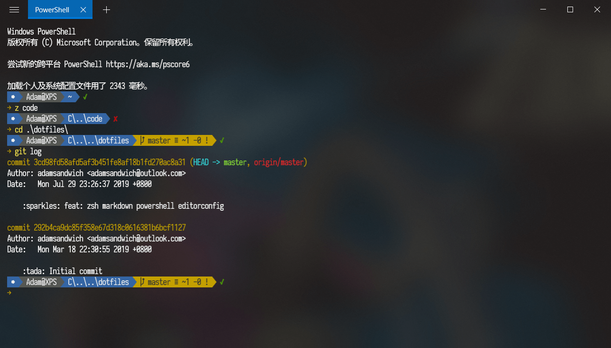

<div align="center"></div>

# dotfiles

> This repo contains my dotfiles.

## Config

- Font: [Sarasa Gothic](https://github.com/be5invis/Sarasa-Gothic)
- Terminal: [Fluent Terminal](https://github.com/felixse/FluentTerminal)
- Package Manager for Windows:
  - Option 1: [Scoop](https://github.com/lukesampson/scoop) with [Extras Bucket](https://github.com/lukesampson/scoop-extras)
  - Option 2: [Choco](https://github.com/chocolatey/choco)

## PowerShell

- [Oh-My-Posh](https://github.com/JanDeDobbeleer/oh-my-posh)
- Theme: `SandwichTechy.psm1`

Go to [Oh-My-Posh](https://github.com/JanDeDobbeleer/oh-my-posh) for information on how to install `Oh-My-Posh`, then:

```PowerShell
$ThemeSettings
```

Then check your theme folder, navigate there, and put `SandwichTechy.psm1` there.
Reload theme by:

```PowerShell
Set-Theme SandwichTechy
```

Also, here's my PowerShell configuration profile: [Microsoft.PowerShell_profile.ps1](/Microsoft.PowerShell_profile.ps1) for reference.
I use:

- [`Get-ChildItemColor`](https://github.com/joonro/Get-ChildItemColor) for better colored `ls`
